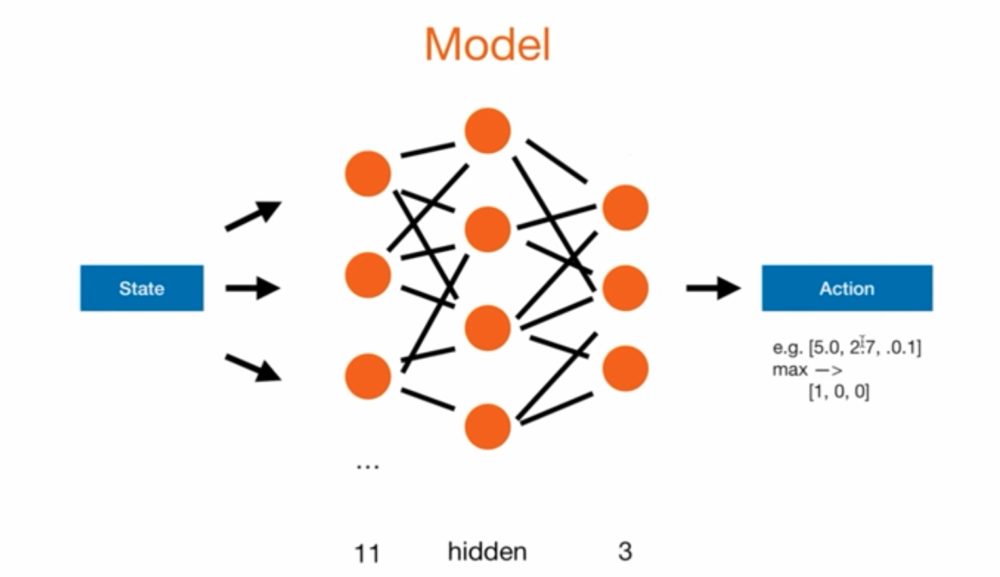

# ReinforcementSnake
Project to understand library `Pygame` and the applicability of machine learning techniques to  learn how to play

## Code organization 

### Agent
Has knowledge about `Game` and `Model` to implement the training loop.

### Game
Allows a game loop within a `play_step` that takes an `action`
as parameter, does a move and returns the current  `reward` if game is over and the 
current `score`.

### Model
A feedforward neuronal network.
Consists of one input layer with eleven neurons (encoding the `state`), hidden layers and one output layer with three 
neurons (encoding `action`)

#### Training
The deep learning strategy used is called ***(Deep) Q Learning*** that improves a 
`Q_value` (quality of an action) using the following steps:

#### Loss Function
Uses the ***Bellman Equation***

Here a simplified version:

$Q = model * predict(state_{0})$
$Q_{new} = R + \gamma * max(Q(state_{1}))$
### Important variables
* `Reward`: is linked to important events, for eating food it is +10, game over gets -10 and everything else gets 0.
* `Action`: encodes the movements, straight `[1,0,0]`, right turn `[0,1,0]`, and left turn `[0,0,1]`.
* `State`: encodes information about the game environment. It has eleven possibilities encoded in boolean values 
`[danger_straight, danger_rigth, danger_left,
  direction_left, direction_rigth, direction_down,
  reward_left, reward_right, reward_up, reward_down]`

